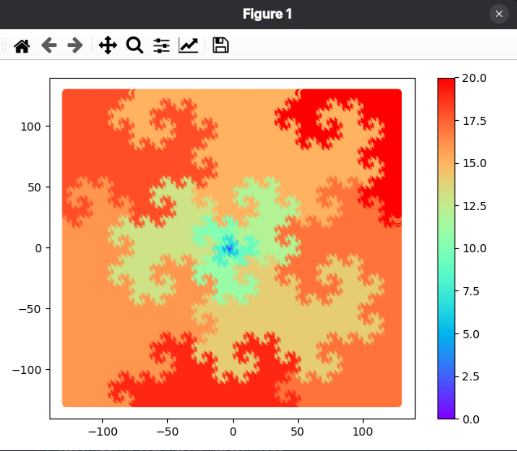

# CBNS arithmetic modules

- [Model and research](#model-and-research)
    - [Connection to fractal geometry](#connection-to-fractal-geometry)
    - [CBNS bit width](#cbns-bit-width)
- [HDL](#hdl)
    - [Tests](#tests)
- [References](#references)


## Model and research

Decimal-to-CBNS converter model, CBNS adder model, tests and some research code, all written in Python, are available in `model` folder. Module structure:
- `model.py` contains `Converter` and `RippleCarryAdder` classes;
- `visualize.py` draws heatmap of CBNS representation bit width on a complex plane;
- `width.py` (iteratively) evaluates CBNS bit width with given input bit width.

### Connection to fractal geometry



This heatmap (`model/visualize.py`) shows how many bits required for CBNS number representation. For more details see [3].

### CBNS bit width

No information on this topic was not found (at least in [1]-[6]). Experperiment was performed using `model/width.py` script. Input number range was $[-2^{N-1}; 2^{N-1}-1]$.

Proposed formula: ${CBNS_{width}}=2N+4$

| N (real & imaginary width) | CBNS width |
| - | - |
| 4	| 12 |
| 5 | 14 |
| 6	| 16 |
| 7	| 18 |
| 8	| 20 |
| 9	| 22 |
| 10 | 24 |
| 11 | 26 |

## HDL

Modules description is available in `hardware` folder.

### Tests

| Prerequsites |
| --- |
| [Icarus](https://github.com/steveicarus/iverilog.git) (version 13.01 was used)|

In order to run:

```bash
cd hardware
./run.sh
```


## References

- [1] Penney, W. (1965). A``Binary'' System for Complex Numbers. J. ACM, 12(2), 247-248
- [2] Gilbert, W. J. (1984). Arithmetic in Complex Bases. Mathematics Magazine, 57(2), 77–81. [https://doi.org/10.1080/0025570X.1984.11977081](https://doi.org/10.1080/0025570X.1984.11977081)
- [3] Gilbert, W.J. Fractal geometry derived from complex bases. The Mathematical Intelligencer 4, 78–86 (1982). https://doi.org/10.1007/BF03023486
- [4] Fractal Binary [https://neuraloutlet.wordpress.com/tag/imaginary/](https://neuraloutlet.wordpress.com/tag/imaginary/)
- [5] Beeler, M.; Gosper, R.W.; Schroeppel, R. HACKMEM. [https://dspace.mit.edu/handle/1721.1/6086](https://dspace.mit.edu/handle/1721.1/6086)
- [6] Saranya, M., Beulet, P. A. S., & Muthunagai, K. (2025). Digital Architecture for CBNS-Based Complex Number Encoding and Arithmetic. IEEE Access, 13, 208176-208191. [https://doi.org/10.1109/ACCESS.2025.3640701](https://doi.org/10.1109/ACCESS.2025.3640701)
